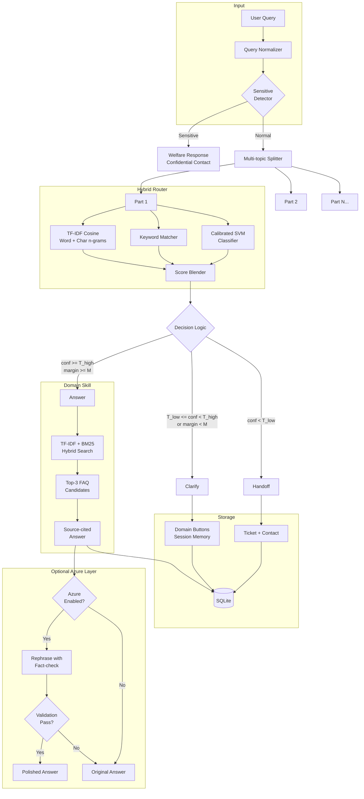

# NexusAI Architecture

## System Overview

NexusAI is a hybrid AI-powered campus assistant that routes queries to domain-specific knowledge bases using a multi-signal scoring system. It runs entirely offline with an optional Azure OpenAI layer for answer polishing.

## Architecture Diagram

## Component Details

### Query Normalizer (`app/normalizer.py`)
- Lowercase + punctuation stripping
- Common typo correction (100+ entries)
- Synonym expansion (wifi → wireless, internet, network, connection)
- Light stemming for morphological variants

### Sensitive Topic Detector (`app/router.py`)
- Regex pattern matching against 30+ sensitive keywords
- Triggers before routing — never reaches FAQ retrieval
- Returns supportive message + confidential contact
- Logs only the category, never the query text

### Hybrid Domain Router (`app/router.py`)
- **Signal 1:** TF-IDF cosine similarity (word + character n-grams)
- **Signal 2:** Keyword hit ratio per domain
- **Signal 3:** Calibrated LinearSVC classifier (Platt scaling)
- Configurable blend weights (default: 35% TF-IDF, 25% keywords, 40% classifier)
- Confidence calibration maps raw scores to 0-100% scale

### Decision Logic
| Condition | Action |
|---|---|
| `confidence >= T_high` AND `margin >= M` | **Answer** — retrieve FAQ |
| `T_low <= confidence < T_high` OR `margin < M` | **Clarify** — show top-2 domain buttons |
| `confidence < T_low` | **Handoff** — create ticket |

Thresholds (`T_high`, `T_low`, `M`) are auto-tuned via cross-validation (`tests/tune.py`).

### Domain Skills (`app/retrieval.py`)
Each domain is a separate `DomainSkill` with:
- TF-IDF + BM25 hybrid retrieval
- Top-3 candidate selection
- Source citation (FAQ ID + last updated date)
- Follow-up suggestion (most similar FAQ)
- "Did you mean?" alternatives

### Session Memory (`app/main.py`)
- Last 5 turns per session
- Pending query + domain for clarify flow
- Pronoun/follow-up resolution via context

### Azure Layer (`app/azure_layer.py`)
- Flag-controlled: `USE_AZURE_OPENAI=true`
- Rephrase answers in friendly tone
- Fact-check validation (URLs, numbers must match)
- 4-second timeout, silent fallback on any error
- Second-opinion routing for low-confidence cases

### Database (`app/database.py`)
- SQLite with WAL mode for concurrent reads
- Tables: `query_logs`, `tickets`, `feedback`
- Analytics queries for admin dashboard
- CSV export of all logs

## Data Flow

1. User sends message → FastAPI validates (Pydantic, rate limit, length cap)
2. Sensitive check → if positive, return welfare response
3. Multi-topic split → process each part independently
4. Route each part → hybrid scoring → decision
5. Retrieve FAQ → source citation → optional Azure rephrase
6. Log to SQLite → return combined response
7. Frontend renders domain badges, confidence bars, source chips
